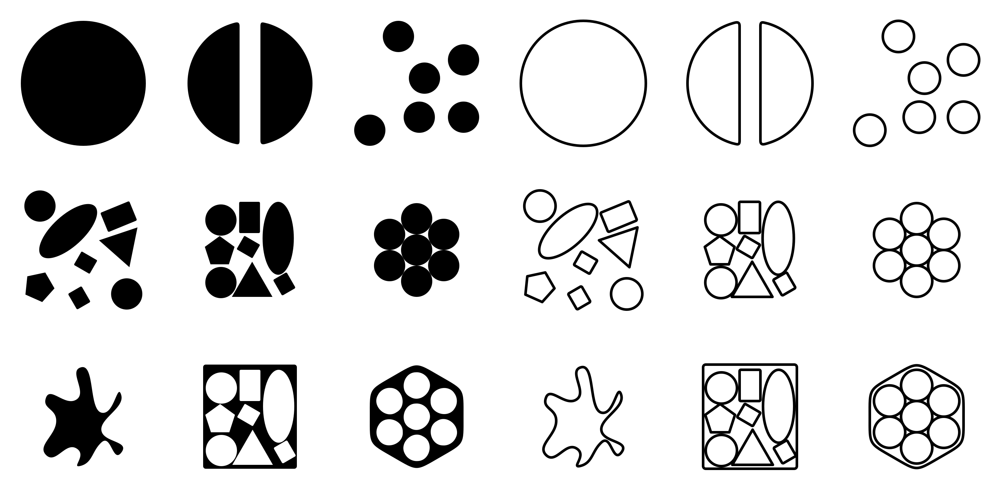
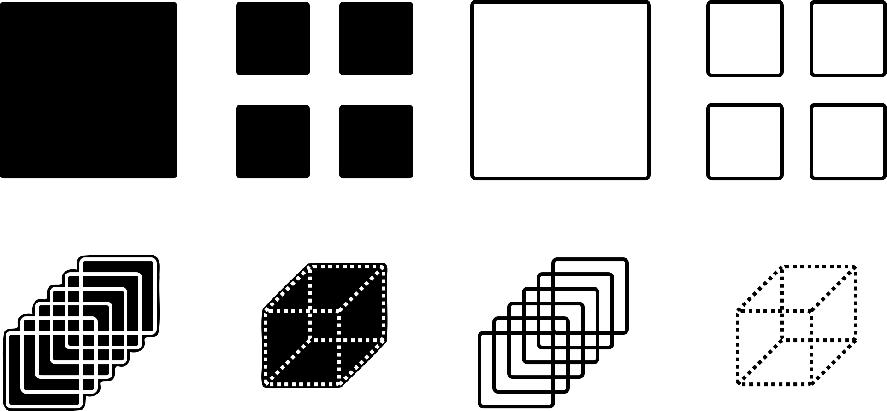
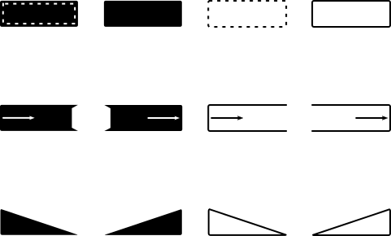

# Libre TNIL documentation

**[Click here for the latest documentation.](https://hactarce.github.io/tnil-freedoc/)**

## Overview

[Ithkuil](http://ithkuil.net/) is a constructed language created by John
Quijada, and TNIL ("The New Ithkuilic Language") is a successor language
sharing many of its design values.

This repo contains a community-driven, libre set of documentation for TNIL
family, including graphics illustrating several morphological categories.

## Contributing

Contributions are welcome!

The [YAML](https://yaml.org/) layout is described in
[yaml/morphology/_template.yaml](yaml/morphology/_template.yaml); formatting
guidelines will come soon. See [progress.md](progress.md) for what's left to be
done.

## Graphics

Graphics are available for several categories.

Each category value illustration should be an SVG object less than 512×512 px.

### Configuration

Configuration describes the physical similarity and spatial
connectedness of the items named by the root.

### Affiliation

Affiliation communicates similarities and dissimilarities of use and purpose
between members of the configurative set.

### Perspective

Perspective quantifies the configurative set as a single, multiple, universal,
or conceptual instance of the root.

### Extension

Extension picks out a spatiotemporal part of the set (beginning, end), its
dynamics (increasing, decreasing), and its characterization as either
circumscribed by or transcending the discursive context.

