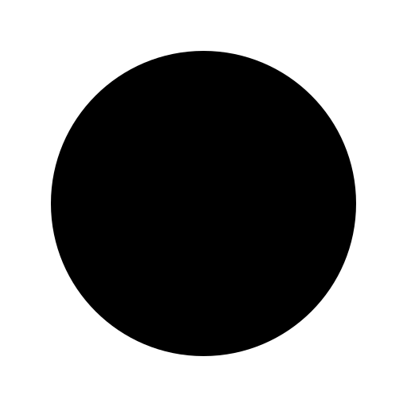
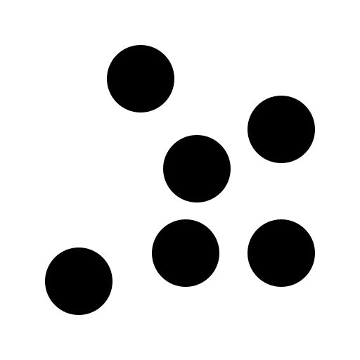
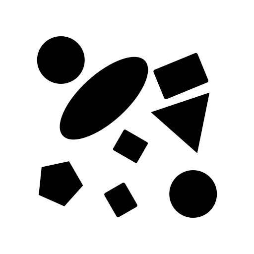
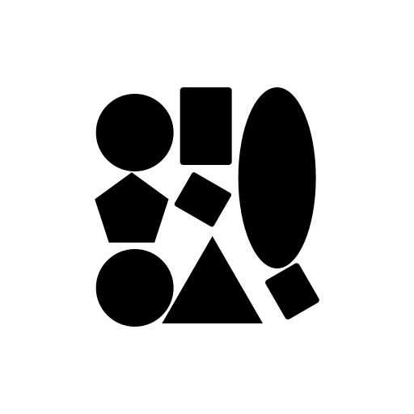
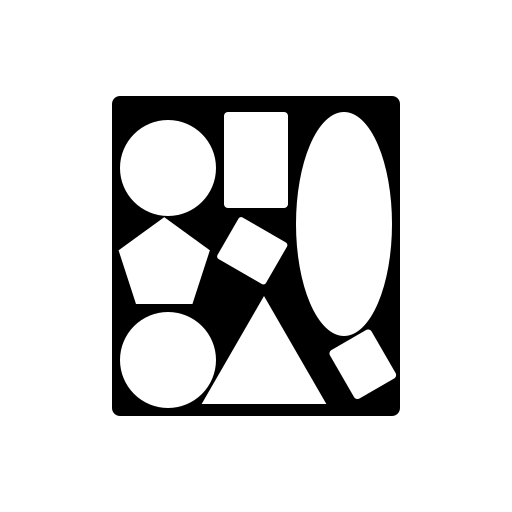

# Configuration
Configuration describes the physical (dis)similarity and spatiotemporal connectedness of the item(s) named by the stem.

There are 9 Configurations:

## Uniplex
Uniplex marks an individual instance.  

## Duplex
Duplex indicates a pair of instances.  

## Discrete
Discrete refers to a group of several similar instances.  

## Aggregative
Aggregative denotes a collection of dissimilar instances.  

## Segmentative
Segmentative refers to a close or contiguous grouping of similar instances.  

## Componential
Componential denotes a close or contiguous collection of dissimilar instances.  

## Coherent
Coherent indicates connected collection of similar instances.  

## Composite
Composite refers to a connected collection of dissimilar instances.  

## Multiform
Multiform denotes a borderline or questionable instance of a stem.  

